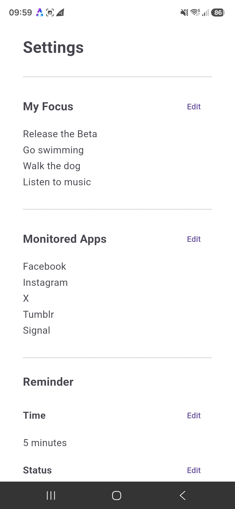
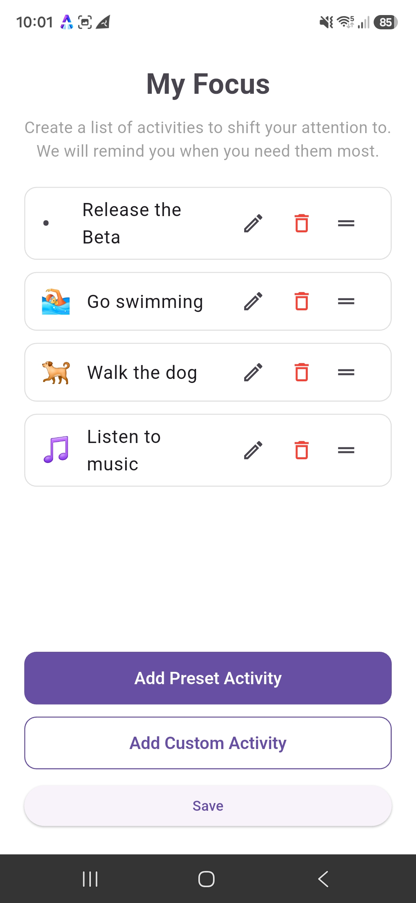
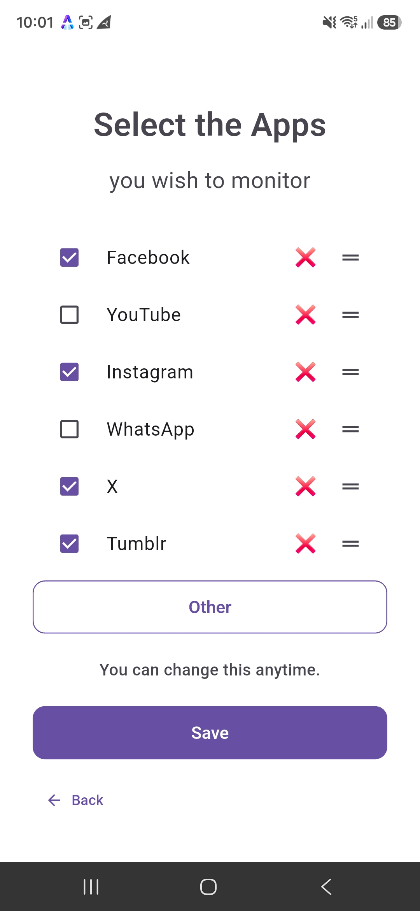
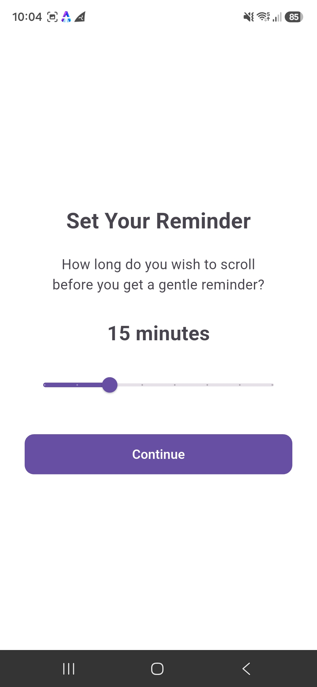
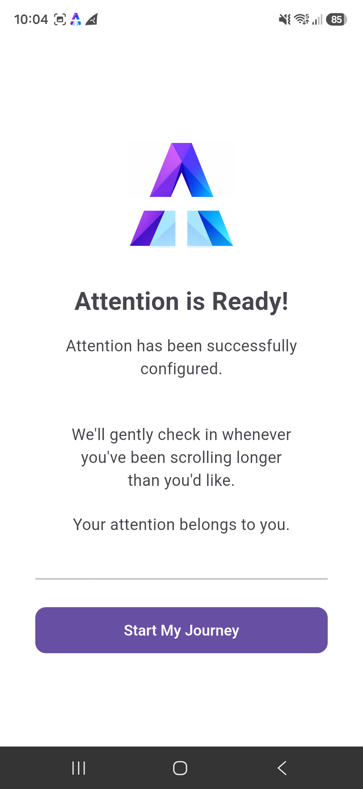
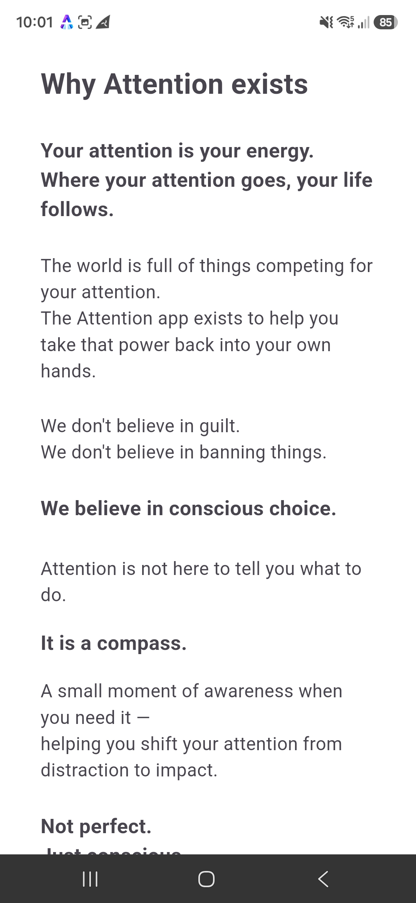

# Attention-Beta
Attention is an Android app that helps you become aware of unconscious scrolling and consciously choose where your attention goes. Early beta — looking for testers and feedback.

# Attention

### Shift your attention from distraction to impact.

Attention is an Android app designed to help you become aware of unconscious scrolling and consciously choose where your attention goes.

In a world where technology is designed to capture our attention, Attention takes a different approach.

It doesn't block your apps.
It doesn't punish you.
It doesn't tell you what you can and cannot do.

Instead, Attention gives you a small moment of awareness when you start scrolling without consciously choosing to.

> **We don't protect your time.
> We help you consciously choose where your attention goes.**

---

## 🧠 How Attention works

Attention quietly monitors the apps you choose to monitor.

When it detects behaviour that looks like prolonged, unconscious scrolling, it gently brings your attention back to the moment.

The goal isn't to stop you from using your phone.

The goal is to help you decide whether you actually want to continue.

### No blocking

You remain completely in control.

### No guilt

Attention doesn't judge your behaviour.

### No punishment

You can always choose to continue.

### Just awareness

A small interruption can create a moment in which you consciously choose what happens next.

---

## 🧪 Join the Attention Beta

We're currently looking for our first group of beta testers.

We're particularly interested in people who regularly find themselves:

- scrolling longer than they intended
- opening an app without consciously deciding to
- losing track of time on social media or other content apps
- wanting more control over where their attention goes

### The 7-Day Attention Experiment

We're asking our first testers to use Attention for approximately 7 days.

We aren't looking for people to tell us that the app is great.

We're looking for honest feedback.

Tell us what works.
Tell us what doesn't.
Tell us what feels useful.
Tell us what feels annoying.

Your feedback will help shape the future of Attention.

**[JOIN THE ATTENTION BETA →](https://form.jotform.com/262183603247051)**

---

## Screenshots

### Dashboard

### Settings

### My Focus

### Monitor the apps that matter

### Set a gentle reminder

### Simple onboarding

### Why Attention exists

---

## 📱 Current Beta

**Platform:** Android

**Stage:** Early Beta

**Version:** 0.1 MVP

Attention is currently being distributed directly to beta testers as an APK.

This is an early version of the product and some things may change considerably as we learn from real users.

---

## 🔐 Trust & Transparency

Attention is built around a simple principle:

### Attention is a guardian, not just an app.

When monitoring is enabled, Attention continues quietly watching over your attention while you use your phone — even when you close the app.

Attention also communicates its monitoring state.

The user should always be able to understand whether Attention is:

- Active
- Paused
- Deactivated
- Unable to monitor because something requires attention

No silent failures.
No hidden states.
No uncertainty.

---

## 💬 Feedback

Feedback from our first users is extremely important.

During the beta, we're particularly interested in:

- How Attention feels when it interrupts you
- Whether the intervention actually makes you more aware
- Whether it changes what you do next
- When Attention gets it right
- When Attention gets it wrong
- What you would change

We're building Attention around real behaviour, not assumptions.

---

## 🌱 Why Attention exists

Millions of people lose time every day to unconscious scrolling.

The problem isn't simply screen time.

The deeper problem is that we increasingly stop consciously choosing where our attention goes.

And where attention goes, energy follows.

Attention exists to help people take that choice back.

> **Where your attention goes, your life grows.**

---

## About

Attention is an independent project currently in early development and beta testing.

**Version 0.1 MVP**

Built with Flutter for Android.

---

### Want to help shape Attention?

Join the beta and become one of our first testers.

**[JOIN THE ATTENTION BETA →](https://form.jotform.com/262183603247051)**
